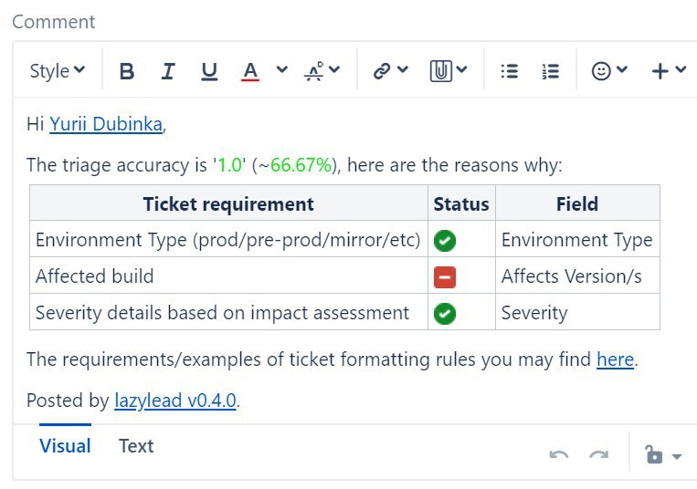
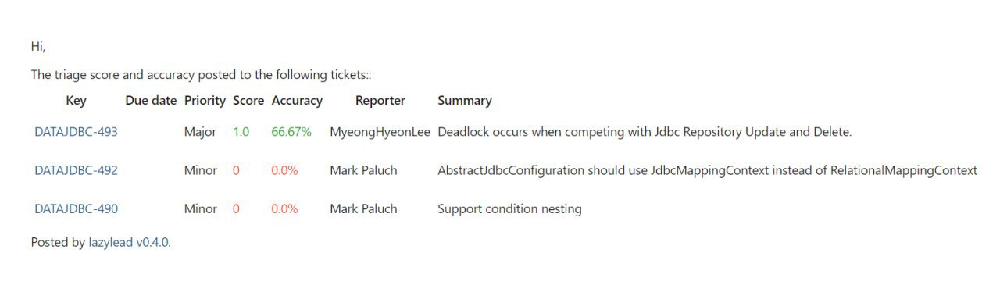

## Give the score for the format of each incoming ticket to your team
#### Why?
When you have a pipeline between several teams, there should be criteria on how to pass a task between groups.
Without this, you may get the delays for your task because your team members have to do the work that is not their business, or they even don't have the skills to do it properly.
As a result, it may cause task delays or quality decreasing.

Even if you define the criteria for passing tasks between teams, it's tough to monitor that those criteria aren't violating. To hire a well-paid additional manager who will check each ticket and send emails its expensive unless you work for a bloody reach company.

This rule periodically checks the format of the ticket, post score results to the ticket, and raise email (one email per bunch of tickets) to you with details.

#### How to use lazylead for this
Let's assume that 
1.  Your team is working in Jira
2.  You want daily to check the format of incoming defects to your team
3.  [JQL](https://www.atlassian.com/blog/jira-software/jql-the-most-flexible-way-to-search-jira-14) for incoming defects: `project='PRJ' and type=Defect and created < -2h and created > -26h`.
    This `< -2h` and `> -26h` gives reporter 2h to fill the ticket correctly, and, after that, the task will evaluate the ticket score.
4.  you've saved this [JQL](https://www.atlassian.com/blog/jira-software/jql-the-most-flexible-way-to-search-jira-14) as jira filter with id `222`. 

For simplicity, we are using [docker-compose](https://docs.docker.com/compose/):
1.  Define yml file with `docker-compose` configuration in `lazylead.yml`
    ```yml
    version: '2.3'
    services:
      lazylead:
        image: dgroup/lazylead:latest
        container_name: lazylead
        mem_limit: 128m
        environment:
          # The jira server details.
          # Please ensure that your jira filter(s) grants this user to see issues.
          # Sometimes jira filter(s) may be created with restricted visibility, thus
          #  lazylead can't find the issues. 
          jira_url: https://your.jira.com
          jira_user: theuser
          jira_password: thepass
        volumes:
          - ./:/lazylead/db
        # db/ll.db is sqlite file with jira related annoying tasks
        entrypoint: bin/lazylead --sqlite db/ll.db --trace --verbose
    ```
    
2.  Create a container, using `docker-compose -f lazylead.yml up`
    The container will stop as there were no tasks provided:
    ```bash
    ll > docker-compose -f lazylead.yml up                                                         
    Creating lazylead ... done
    Attaching to lazylead
    lazylead    | [2020-08-09T06:17:32] DEBUG [main] Version: 0.4.0
    lazylead    | [2020-08-09T06:17:32] DEBUG [main] Memory footprint at start is 52MB
    lazylead    | [2020-08-09T06:17:32] DEBUG [main] Database: '/lazylead/db/ll.db', sql migration dir: '/lazylead/upgrades/sqlite'
    lazylead    | [2020-08-09T06:17:32] DEBUG [main] Migration applied to /lazylead/db/ll.db from /lazylead/upgrades/sqlite
    lazylead    | [2020-08-09T06:17:32] DEBUG [main] Database connection established
    lazylead    | [2020-08-09T06:17:32] DEBUG [main] SMTP connection established with {host} as {user}.
    lazylead    | [2020-08-09T06:17:32] WARN  [main] ll-001: No tasks found.
    lazylead    | [2020-08-09T06:17:32] DEBUG [main] Memory footprint at the end is 67MB
    ll > 
    ```

3.  Define your team and tasks in database. 
    The tables structure defined [here](../upgrades/sqlite/001-install-main-lazylead-tables.sql).
    Modify you [sqlite](https://sqlite.com/index.html) file(`ll.db`) using [DB Browser](https://sqlitebrowser.org/) or any similar tool.
    ```sql
    insert into teams (id, name, properties) 
               values (1, 'Dream team with lazylead', '{}');
    insert into systems(id, properties)    
               values (1,'{"type":"Lazylead::Jira", "username":"${jira_user}", "password":"${jira_password}", "site":"${jira_url}", "context_path":""}');
    insert into tasks (name, cron, enabled, id, system, team_id, action, properties)
               values ('Propagate customfield_1 (External ID) to sub-tasks', 
                       '0 8 * * 1-5', 
                       'true',
                       1, 1, 1, 
                       'Lazylead::Task::PropagateDown',
                       '{
                            "jql":    "filter=222", 
                            "to":     "lead@fake.com",
                            "rules":  "Lazylead::RequirementAffectedBuild",
                            "colors": "{ "0": "#FF4F33", "35": "#FF9F33", "57": "#19DD1E", "90": "#0FA81A" }",
                            "docs":         "https://github.com/dgroup/lazylead/blob/master/.github/ISSUE_TEMPLATE/bug_report.md",
                            "max_results":  "200",
                            "subject":      "[LL] Raised tickets",
                            "template":     "lib/messages/accuracy.erb"
                        }
                       ');
    ```
    Yes, for task scheduling we are using [cron](https://crontab.guru).

4.  Once you changed `./ll.db`, please restart the container using `docker-compose -f .github/tasks.yml restart`
    ```bash
    ll > docker-compose -f .github/tasks.yml restart
    Restarting lazylead ... done
    ```

5.  Once task completed, please check your defects, they should have comment like
    
    and you'll get an email like
    
    

#### Where is the code?
| Logic | Tests |
| :-----: | :------: |
| [accuracy.rb](../lib/lazylead/task/accuracy.rb)| [accuracy_test.rb](../test/lazylead/task/accuracy_test.rb) | 

#### How can I add my own rules?
They should extend `Lazylead::Requirement` class and available in `lib/lazylead/task` folder.
After that you need to mention your custom rules in `rules` option in column `properties` from `tasks` table